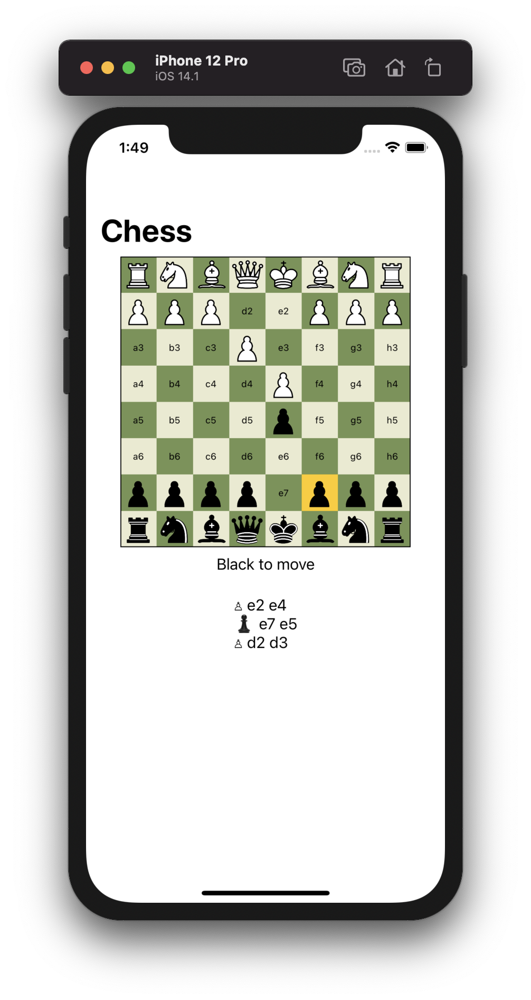
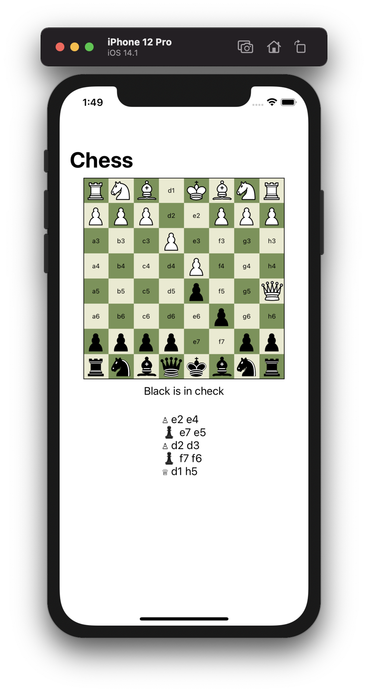

## Chess

A two player chess game implemented in SwiftUI! This one was a lot of fun, and I got some practice writing test cases for the move validation.

There are definitely a few bugs & code paths that I haven't covered with tests, and I may come back to this in the future.

## Screenshots

|   |   | 
|:-:|:-:|
|  |  |

## License

MIT
